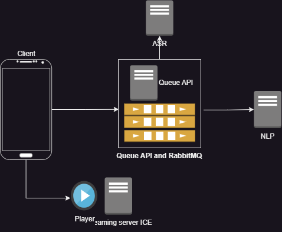

# Rendu de mi-parcours

[Repo Github](https://github.com/YacineTrousselle/Archi-distribue)

- Application cliente en Android Java
- Le client Android envoie des messages qui seront ecrits dans la bonne queue par l'API.
- Une queue par service, les services consument les messages lorsqu'ils sont disponibles.
- Le client peut communiquer directement avec le serveur Ice (pas sur pour le moment)

Si c'est trop complique a implementer alors je ferais des services Web avec une API pour l'ASR et une autre pour le NLP.

# Rendu final

Finalement j'ai fait des services Web.   
Du coup j'ai une API Web pour l'ASR et une API Web pour le NLP.  
L'appli Android peut communiquer avec le serveur Ice et effectuer les fonctionnalites de base tel que rechercher une musique, la jouer ou uploader une musique.  

# ASR

L'ASR utilise le model Whipser pour transcrire un audio. Il est possible d'y acceder via la route API que j'expose grace a FastAPI, auquelle on envoie l'audio a transcrire.  

# NLP

Pour le NLP j'utilise Spacy, je recupere les verbes dans la phrase et je compare avec le tableau de correspondance action-verbe que j'ai defini. C'est egalement expose via une API WEB.  
